# LearnPytorchFashionMNIST
Learning Pytorch using the FashionMNIST dataset.

## TABLE OF CONTENTS
* [Installation Instructions](#installation-instructions)
* [Dataset](#dataset)
* [Development Summary](#development-summary)
* [Final Model](#final-model)
* [References](#references)

## Installation Instructions
1. In VSCode, create a new workspace.  
2. Activate a conda env.
3. Install git in the conda environment. conda install git
4. Clone the project. git clone [URL]

## Dataset
Training set: 60,000
Test set: 10,000
Each example: 28x28 grayscale image associated with 1 label from 10 classes.

## Development Summary
In order to learn basic PyTorch to implement, test, and improve a neural network, an overall structure consisting of a data section, model section, training and testing functions, plotting function, loss and optimizer, and a training loop function was implemented. 

### Models
<details><summary>v1</summary>
<p>
This first model serves to test the implementation of the entire pipeline from data loading to test sample classification in Pytorch.

```python
device = "cuda" if torch.cuda.is_available() else "cpu"
print(f"Using {device} device")

class NeuralNetwork_v1(nn.Module):
    x_size = 0
    # define the layers
    def __init__(self):
        super().__init__()
        self.feature_extraction = nn.Sequential(
            nn.Conv2d(in_channels=1, out_channels=1, kernel_size=(3,3)),
            nn.ReLU(),
            nn.Conv2d(in_channels=1, out_channels=1, kernel_size=(3,3)),
            nn.ReLU(),
            nn.Flatten()
        )
        self.dense_layers = nn.Sequential(
            nn.Linear(in_features=576, out_features=64),
            nn.ReLU(),
            nn.Linear(in_features=64, out_features=32),
            nn.ReLU(),
            nn.Linear(in_features=32, out_features=10),
            nn.Softmax(dim=1)
        )
    def forward(self, x):
        x = self.feature_extraction(x)
        x_size = x.size()
        # print(x_size)
        logits = self.dense_layers(x)
        return logits
        
model_v1 = NeuralNetwork_v1().to(device)
summary(model_v1, input_size=(batch_size, 1, 28, 28))
```

    ==========================================================================================
    Layer (type:depth-idx)                   Output Shape              Param #
    ==========================================================================================
    NeuralNetwork_v1                         [64, 10]                  --
    ├─Sequential: 1-1                        [64, 576]                 --
    │    └─Conv2d: 2-1                       [64, 1, 26, 26]           10
    │    └─ReLU: 2-2                         [64, 1, 26, 26]           --
    │    └─Conv2d: 2-3                       [64, 1, 24, 24]           10
    │    └─ReLU: 2-4                         [64, 1, 24, 24]           --
    │    └─Flatten: 2-5                      [64, 576]                 --
    ├─Sequential: 1-2                        [64, 10]                  --
    │    └─Linear: 2-6                       [64, 64]                  36,928
    │    └─ReLU: 2-7                         [64, 64]                  --
    │    └─Linear: 2-8                       [64, 32]                  2,080
    │    └─ReLU: 2-9                         [64, 32]                  --
    │    └─Linear: 2-10                      [64, 10]                  330
    │    └─Softmax: 2-11                     [64, 10]                  --
    ==========================================================================================
    Total params: 39,358
    Trainable params: 39,358
    Non-trainable params: 0
    Total mult-adds (M): 3.32
    ==========================================================================================
    Input size (MB): 0.20
    Forward/backward pass size (MB): 0.70
    Params size (MB): 0.16
    Estimated Total Size (MB): 1.05
    ==========================================================================================
Accuracy             |  Loss
:-------------------------:|:-------------------------:
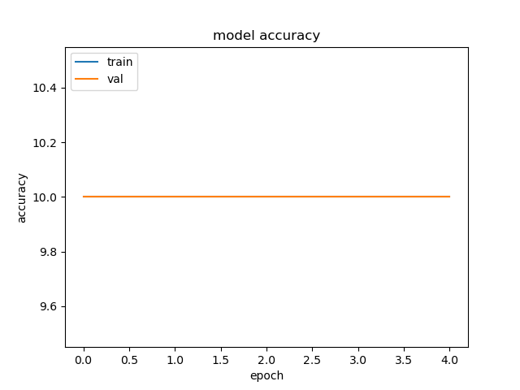 | 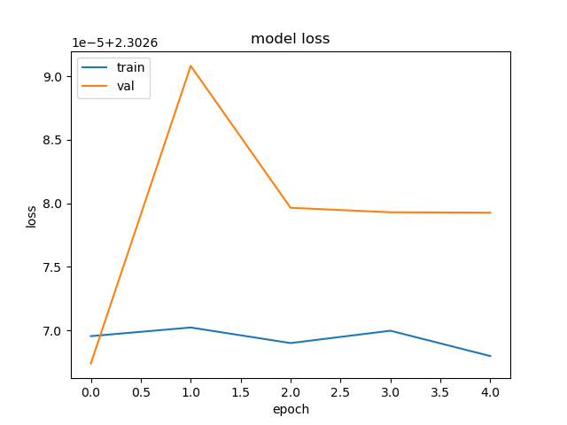
</p>
</details>

The following models (v1_5_5 and v1_5_5_BN) are included to illustrate the effects of batch normalization on the model's training and performance.
<details><summary>v1_5_5</summary>
<p>
No batch normalization.
    
```python
# Increasing num of elt in 1st layer 128->258. Reducing 2nd dense layer 128 -> 64
class NeuralNetwork_v1_5_5(nn.Module):
    def __init__(self) -> None:
        super().__init__()
        self.feature_extraction = nn.Sequential(
            nn.Conv2d(in_channels=1, out_channels=32, kernel_size=(3,3), padding='same'),
            nn.Conv2d(in_channels=32, out_channels=32, kernel_size=(3,3), padding='same'),
            nn.ReLU(),
            nn.Conv2d(in_channels=32, out_channels=64, kernel_size=(3,3), padding='same'),
            nn.Conv2d(in_channels=64, out_channels=64, kernel_size=(3,3), padding='same'),
            nn.ReLU(),
            nn.Conv2d(in_channels=64, out_channels=128, kernel_size=(3,3), padding='same'),
            nn.Conv2d(in_channels=128, out_channels=128, kernel_size=(3,3), padding='same'),
            nn.ReLU(),
            nn.Flatten(),
        )
        self.dense_layers = nn.Sequential(
            nn.Linear(in_features=28*28*128, out_features=256),
            nn.ReLU(),
            nn.Linear(in_features=256, out_features=64),
            nn.ReLU(),
            nn.Linear(in_features=64, out_features=10),
            nn.Softmax(dim=1)
        )

    def forward(self, x):
        logits = self.feature_extraction(x)
        logits = self.dense_layers(logits)
        return logits

# model = NeuralNetwork_v1_5_5().to(device)
# summary(model, input_size=(batch_size, 1, 28, 28))
```
    ==========================================================================================
    Layer (type:depth-idx)                   Output Shape              Param #
    ==========================================================================================
    NeuralNetwork_v1_5_5                     [64, 10]                  --
    ├─Sequential: 1-1                        [64, 100352]              --
    │    └─Conv2d: 2-1                       [64, 32, 28, 28]          320
    │    └─Conv2d: 2-2                       [64, 32, 28, 28]          9,248
    │    └─ReLU: 2-3                         [64, 32, 28, 28]          --
    │    └─Conv2d: 2-4                       [64, 64, 28, 28]          18,496
    │    └─Conv2d: 2-5                       [64, 64, 28, 28]          36,928
    │    └─ReLU: 2-6                         [64, 64, 28, 28]          --
    │    └─Conv2d: 2-7                       [64, 128, 28, 28]         73,856
    │    └─Conv2d: 2-8                       [64, 128, 28, 28]         147,584
    │    └─ReLU: 2-9                         [64, 128, 28, 28]         --
    │    └─Flatten: 2-10                     [64, 100352]              --
    ├─Sequential: 1-2                        [64, 10]                  --
    │    └─Linear: 2-11                      [64, 256]                 25,690,368
    │    └─ReLU: 2-12                        [64, 256]                 --
    │    └─Linear: 2-13                      [64, 64]                  16,448
    │    └─ReLU: 2-14                        [64, 64]                  --
    │    └─Linear: 2-15                      [64, 10]                  650
    │    └─Softmax: 2-16                     [64, 10]                  --
    ==========================================================================================
    Total params: 25,993,898
    Trainable params: 25,993,898
    Non-trainable params: 0
    Total mult-adds (G): 16.02
    ==========================================================================================
    Input size (MB): 0.20
    Forward/backward pass size (MB): 180.00
    Params size (MB): 103.98
    Estimated Total Size (MB): 284.18
    ==========================================================================================
</p>
</details>
<details><summary>v1_5_5_BN</summary>
<p>
Batch normalization helps accelerate the training of the neural network by reducing internal covariate shift (i.e., reducing the change in the distribution of the activations that occur during training) while allowing for a higher learning rate [2]. Therefore, in order to improve the model while testing for the effects of batch normalization, batch normalization was added before each activation function and model v1_5_5_BN was trained multiple times with different static learning rates.

```python
# Adding BN before every activation layer.
class NeuralNetwork_v1_5_5_BN(nn.Module):
    def __init__(self) -> None:
        super().__init__()
        self.feature_extraction = nn.Sequential(
            nn.Conv2d(in_channels=1, out_channels=32, kernel_size=(3,3), padding='same'),
            nn.Conv2d(in_channels=32, out_channels=32, kernel_size=(3,3), padding='same'),
            nn.BatchNorm2d(num_features=32),
            nn.ReLU(),
            nn.Conv2d(in_channels=32, out_channels=64, kernel_size=(3,3), padding='same'),
            nn.Conv2d(in_channels=64, out_channels=64, kernel_size=(3,3), padding='same'),
            nn.BatchNorm2d(num_features=64),
            nn.ReLU(),
            nn.Conv2d(in_channels=64, out_channels=128, kernel_size=(3,3), padding='same'),
            nn.Conv2d(in_channels=128, out_channels=128, kernel_size=(3,3), padding='same'),
            nn.BatchNorm2d(num_features=128),
            nn.ReLU(),
            nn.Flatten(),
        )
        self.dense_layers = nn.Sequential(
            nn.Linear(in_features=28*28*128, out_features=256),
            nn.BatchNorm1d(num_features=256),
            nn.ReLU(),
            nn.Linear(in_features=256, out_features=64),
            nn.BatchNorm1d(num_features=64),
            nn.ReLU(),
            nn.Linear(in_features=64, out_features=10),
            nn.Softmax(dim=1)
        )

    def forward(self, x):
        logits = self.feature_extraction(x)
        logits = self.dense_layers(logits)
        return logits

model = NeuralNetwork_v1_5_5_BN().to(device)
summary(model, input_size=(batch_size, 1, 28, 28))
```

    ==========================================================================================
    Layer (type:depth-idx)                   Output Shape              Param #
    ==========================================================================================
    NeuralNetwork_v1_5_5_BN                  [64, 10]                  --
    ├─Sequential: 1-1                        [64, 100352]              --
    │    └─Conv2d: 2-1                       [64, 32, 28, 28]          320
    │    └─Conv2d: 2-2                       [64, 32, 28, 28]          9,248
    │    └─BatchNorm2d: 2-3                  [64, 32, 28, 28]          64
    │    └─ReLU: 2-4                         [64, 32, 28, 28]          --
    │    └─Conv2d: 2-5                       [64, 64, 28, 28]          18,496
    │    └─Conv2d: 2-6                       [64, 64, 28, 28]          36,928
    │    └─BatchNorm2d: 2-7                  [64, 64, 28, 28]          128
    │    └─ReLU: 2-8                         [64, 64, 28, 28]          --
    │    └─Conv2d: 2-9                       [64, 128, 28, 28]         73,856
    │    └─Conv2d: 2-10                      [64, 128, 28, 28]         147,584
    │    └─BatchNorm2d: 2-11                 [64, 128, 28, 28]         256
    │    └─ReLU: 2-12                        [64, 128, 28, 28]         --
    │    └─Flatten: 2-13                     [64, 100352]              --
    ├─Sequential: 1-2                        [64, 10]                  --
    │    └─Linear: 2-14                      [64, 256]                 25,690,368
    │    └─BatchNorm1d: 2-15                 [64, 256]                 512
    │    └─ReLU: 2-16                        [64, 256]                 --
    │    └─Linear: 2-17                      [64, 64]                  16,448
    │    └─BatchNorm1d: 2-18                 [64, 64]                  128
    │    └─ReLU: 2-19                        [64, 64]                  --
    │    └─Linear: 2-20                      [64, 10]                  650
    │    └─Softmax: 2-21                     [64, 10]                  --
    ==========================================================================================
    Total params: 25,994,986
    Trainable params: 25,994,986
    Non-trainable params: 0
    Total mult-adds (G): 16.02
    ==========================================================================================
    Input size (MB): 0.20
    Forward/backward pass size (MB): 270.08
    Params size (MB): 103.98
    Estimated Total Size (MB): 374.26
    ==========================================================================================
| Model  |  Accuracy             |  Loss  |
|:-------------------------:|:-------------------------:|------|
| No BN | 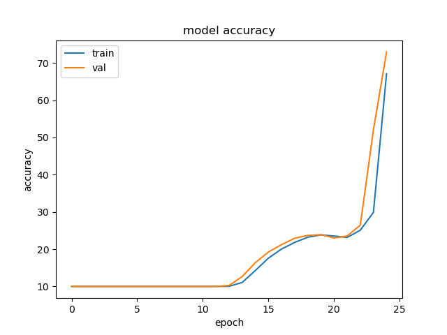 | 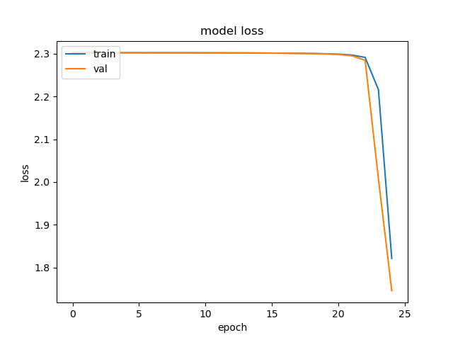 |
| BN | 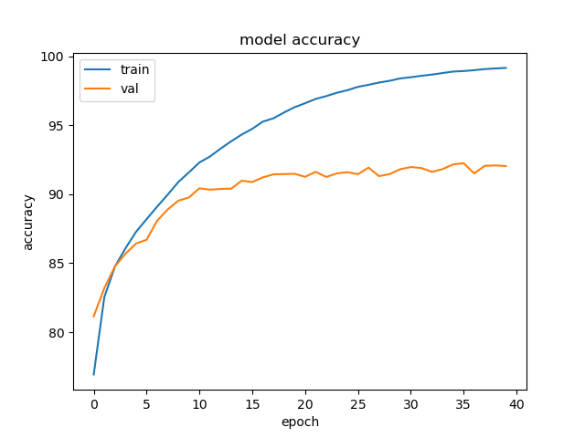 | 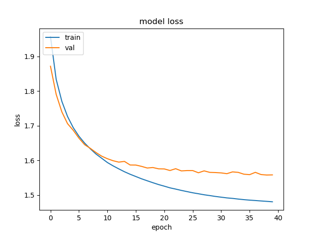 |
| lrx2 | 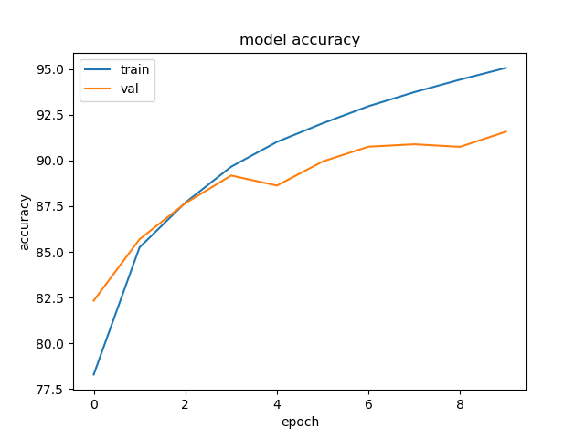 | 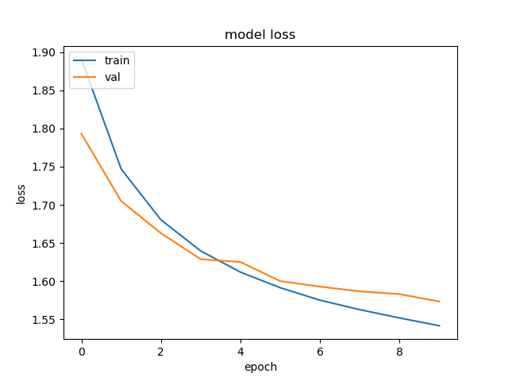 |
| lrx4 | 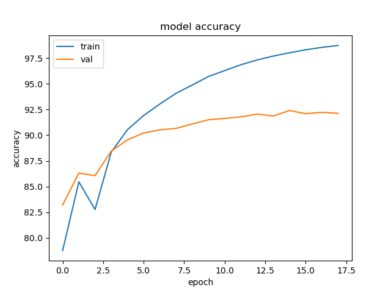 | 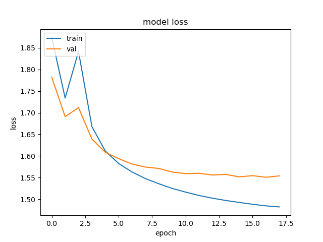 |
| lrx8 | 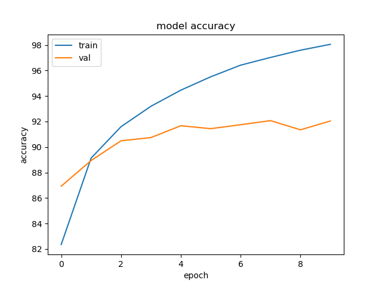 | 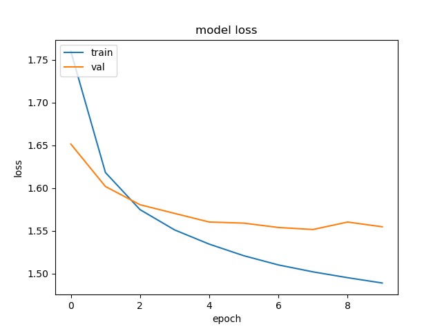 |

Overall, as the learning rate increases, the model achieves a higher training and test accuracy at earlier epochs. Therefore, batch normalization combined with a higher learning rate corresponds to faster learning, which agrees with Ioffe and Szegedy's results. (In the interest of time, each learning rate test was only run once. Otherwise, each test would need to be run multiple times then averaged before comparing them.)
</p>
</details>


<details><summary>Pretrained resnet18</summary>
<p>

```python
from torchvision import datasets, models, transforms

resnet18 = models.resnet18(weights='DEFAULT')
num_ftrs = resnet18.fc.in_features
resnet18.conv1 = nn.Conv2d(1, 64, kernel_size=(7, 7), stride=(2, 2), padding=(3, 3), bias=False)
resnet18.fc = nn.Linear(num_ftrs, 10)
resnet18.to(device)
summary(resnet18, input_size=(batch_size, 1, 28, 28))
```

    ==========================================================================================
    Layer (type:depth-idx)                   Output Shape              Param #
    ==========================================================================================
    ResNet                                   [64, 10]                  --
    ├─Conv2d: 1-1                            [64, 64, 14, 14]          3,136
    ├─BatchNorm2d: 1-2                       [64, 64, 14, 14]          128
    ├─ReLU: 1-3                              [64, 64, 14, 14]          --
    ├─MaxPool2d: 1-4                         [64, 64, 7, 7]            --
    ├─Sequential: 1-5                        [64, 64, 7, 7]            --
    │    └─BasicBlock: 2-1                   [64, 64, 7, 7]            --
    │    │    └─Conv2d: 3-1                  [64, 64, 7, 7]            36,864
    │    │    └─BatchNorm2d: 3-2             [64, 64, 7, 7]            128
    │    │    └─ReLU: 3-3                    [64, 64, 7, 7]            --
    │    │    └─Conv2d: 3-4                  [64, 64, 7, 7]            36,864
    │    │    └─BatchNorm2d: 3-5             [64, 64, 7, 7]            128
    │    │    └─ReLU: 3-6                    [64, 64, 7, 7]            --
    │    └─BasicBlock: 2-2                   [64, 64, 7, 7]            --
    │    │    └─Conv2d: 3-7                  [64, 64, 7, 7]            36,864
    │    │    └─BatchNorm2d: 3-8             [64, 64, 7, 7]            128
    │    │    └─ReLU: 3-9                    [64, 64, 7, 7]            --
    │    │    └─Conv2d: 3-10                 [64, 64, 7, 7]            36,864
    │    │    └─BatchNorm2d: 3-11            [64, 64, 7, 7]            128
    │    │    └─ReLU: 3-12                   [64, 64, 7, 7]            --
    ├─Sequential: 1-6                        [64, 128, 4, 4]           --
    │    └─BasicBlock: 2-3                   [64, 128, 4, 4]           --
    │    │    └─Conv2d: 3-13                 [64, 128, 4, 4]           73,728
    │    │    └─BatchNorm2d: 3-14            [64, 128, 4, 4]           256
    │    │    └─ReLU: 3-15                   [64, 128, 4, 4]           --
    │    │    └─Conv2d: 3-16                 [64, 128, 4, 4]           147,456
    │    │    └─BatchNorm2d: 3-17            [64, 128, 4, 4]           256
    │    │    └─Sequential: 3-18             [64, 128, 4, 4]           8,448
    │    │    └─ReLU: 3-19                   [64, 128, 4, 4]           --
    │    └─BasicBlock: 2-4                   [64, 128, 4, 4]           --
    │    │    └─Conv2d: 3-20                 [64, 128, 4, 4]           147,456
    │    │    └─BatchNorm2d: 3-21            [64, 128, 4, 4]           256
    │    │    └─ReLU: 3-22                   [64, 128, 4, 4]           --
    │    │    └─Conv2d: 3-23                 [64, 128, 4, 4]           147,456
    │    │    └─BatchNorm2d: 3-24            [64, 128, 4, 4]           256
    │    │    └─ReLU: 3-25                   [64, 128, 4, 4]           --
    ├─Sequential: 1-7                        [64, 256, 2, 2]           --
    │    └─BasicBlock: 2-5                   [64, 256, 2, 2]           --
    │    │    └─Conv2d: 3-26                 [64, 256, 2, 2]           294,912
    │    │    └─BatchNorm2d: 3-27            [64, 256, 2, 2]           512
    │    │    └─ReLU: 3-28                   [64, 256, 2, 2]           --
    │    │    └─Conv2d: 3-29                 [64, 256, 2, 2]           589,824
    │    │    └─BatchNorm2d: 3-30            [64, 256, 2, 2]           512
    │    │    └─Sequential: 3-31             [64, 256, 2, 2]           33,280
    │    │    └─ReLU: 3-32                   [64, 256, 2, 2]           --
    │    └─BasicBlock: 2-6                   [64, 256, 2, 2]           --
    │    │    └─Conv2d: 3-33                 [64, 256, 2, 2]           589,824
    │    │    └─BatchNorm2d: 3-34            [64, 256, 2, 2]           512
    │    │    └─ReLU: 3-35                   [64, 256, 2, 2]           --
    │    │    └─Conv2d: 3-36                 [64, 256, 2, 2]           589,824
    │    │    └─BatchNorm2d: 3-37            [64, 256, 2, 2]           512
    │    │    └─ReLU: 3-38                   [64, 256, 2, 2]           --
    ├─Sequential: 1-8                        [64, 512, 1, 1]           --
    │    └─BasicBlock: 2-7                   [64, 512, 1, 1]           --
    │    │    └─Conv2d: 3-39                 [64, 512, 1, 1]           1,179,648
    │    │    └─BatchNorm2d: 3-40            [64, 512, 1, 1]           1,024
    │    │    └─ReLU: 3-41                   [64, 512, 1, 1]           --
    │    │    └─Conv2d: 3-42                 [64, 512, 1, 1]           2,359,296
    │    │    └─BatchNorm2d: 3-43            [64, 512, 1, 1]           1,024
    │    │    └─Sequential: 3-44             [64, 512, 1, 1]           132,096
    │    │    └─ReLU: 3-45                   [64, 512, 1, 1]           --
    │    └─BasicBlock: 2-8                   [64, 512, 1, 1]           --
    │    │    └─Conv2d: 3-46                 [64, 512, 1, 1]           2,359,296
    │    │    └─BatchNorm2d: 3-47            [64, 512, 1, 1]           1,024
    │    │    └─ReLU: 3-48                   [64, 512, 1, 1]           --
    │    │    └─Conv2d: 3-49                 [64, 512, 1, 1]           2,359,296
    │    │    └─BatchNorm2d: 3-50            [64, 512, 1, 1]           1,024
    │    │    └─ReLU: 3-51                   [64, 512, 1, 1]           --
    ├─AdaptiveAvgPool2d: 1-9                 [64, 512, 1, 1]           --
    ├─Linear: 1-10                           [64, 10]                  5,130
    ==========================================================================================
    Total params: 11,175,370
    Trainable params: 11,175,370
    Non-trainable params: 0
    Total mult-adds (G): 2.11
    ==========================================================================================
    Input size (MB): 0.20
    Forward/backward pass size (MB): 44.05
    Params size (MB): 44.70
    Estimated Total Size (MB): 88.95
    ==========================================================================================
Accuracy             |  Loss
:-------------------------:|:-------------------------:
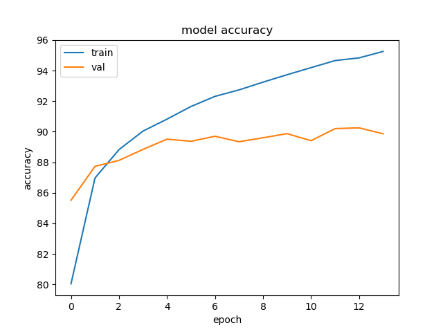 | 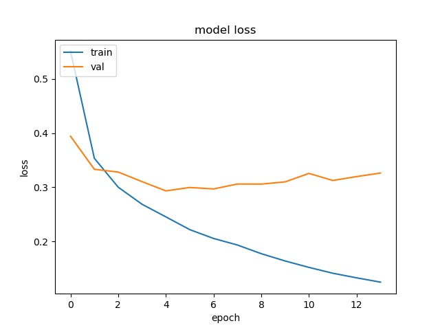

</p>
</details>


## References
[1]     Fashion-MNIST: a Novel Image Dataset for Benchmarking Machine Learning Algorithms. Han Xiao, Kashif Rasul, Roland Vollgraf. [Online]. Available: [arXiv:1708.07747](https://arxiv.org/abs/1708.07747)

[2]     S. Ioffe and C. Szegedy, "Batch Normalization: Accelerating Deep Network Training by Reducing Internal Covariate Shift," Mar. 2, 2015. [Online]. Available: [https://arxiv.org/abs/1502.03167](https://arxiv.org/abs/1502.03167)
